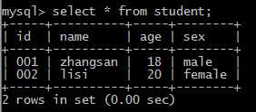
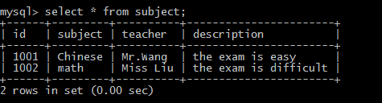
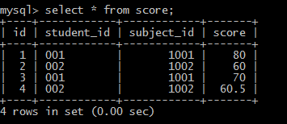

新建一个名叫student_examination_sys的数据库：
```
create DATABASE student_examination_sys;
```
1. 新建一个名为student的表：
```
CREATE TABLE student(
  id VARCHAR(10) NOT NULL,
  name VARCHAR(40) NOT NULL,
  age INT NOT NULL,
  sex VARCHAR(20) NOT NULL,
  PRIMARY KEY (id)
)ENGINE=InnoDB DEFAULT CHARSET=utf8;
```
插入数据：
```
INSERT INTO student(
  id,name,age,sex)
  values
  ("001","zhangsan",18,"male");
```
```
INSERT INTO student(
  id,name,age,sex)
  values
  ("002","lisi",20,"female");
```

2. 新建一个名为subject的表：
```
CREATE TABLE subject(
  id INT NOT NULL AUTO_INCREMENT,
  subject VARCHAR(20) NOT NULL,
  teacher VARCHAR(30) NOT NULL,
  description VARCHAR(255) NOT NULL,
  PRIMARY KEY (id)
)ENGINE=InnoDB DEFAULT CHARSET=utf8;
```
插入数据：
```
INSERT INTO subject(
  id,subject,teacher,description)
  values
  (1001,"Chinese","Mr. Wang","the exam is easy");
```
```
INSERT INTO subject(
  id,subject,teacher,description)
  values
  (1002,"math","Miss Liu","the exam is difficult");
```

3. 新建一个名为score的表：
```
CREATE TABLE score(
  id INT NOT NULL AUTO_INCREMENT,
  student_id VARCHAR(10) NOT NULL,
  subject_id INT NOT NULL,
  score DOUBLE NOT NULL,
  PRIMARY KEY (id)
)ENGINE=InnoDB DEFAULT CHARSET=utf8;
```
插入数据：
```
INSERT INTO score(
  student_id,subject_id,score)
  values
  ("001",1001,80);
```
```
INSERT INTO score(
  student_id,subject_id,score)
  values
  ("002",1002,60);
```
```
INSERT INTO score(
  student_id,subject_id,score)
  values
  ("001",1001,70);
```
```
INSERT INTO score(
  student_id,subject_id,score)
  values
  ("002",1002,60.5);
```

